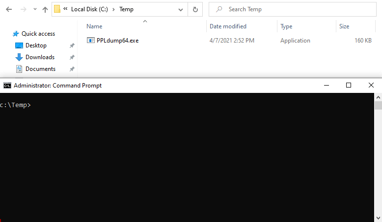

# PPLdump

This tool implements a __userland__ exploit that was initially discussed by James Forshaw (a.k.a. [@tiraniddo](https://twitter.com/tiraniddo)) - in this [blog post](https://googleprojectzero.blogspot.com/2018/08/windows-exploitation-tricks-exploiting.html) - for __dumping the memory of any PPL__ as an administrator.

I wrote two blog posts about this tool. The first part is about Protected Processes concepts while the second one dicusses the bypass technique itself.

- __Blog post part #1__: [Do You Really Know About LSA Protection (RunAsPPL)?](https://itm4n.github.io/lsass-runasppl/)
- __Blog post part #2__: [Bypassing LSA Protection in Userland](https://blog.scrt.ch/2021/04/22/bypassing-lsa-protection-in-userland/)

<p align="center">
  
</p>

## Usage

Simply run the executable without any argument and you will get a detailed help/usage.

```console
c:\Temp>PPLdump64.exe
 _____ _____ __      _
|  _  |  _  |  |   _| |_ _ _____ ___
|   __|   __|  |__| . | | |     | . |  version 0.4
|__|  |__|  |_____|___|___|_|_|_|  _|  by @itm4n
                                |_|

Description:
  Dump the memory of a Protected Process Light (PPL) with a *userland* exploit

Usage:
  PPLdump.exe [-v] [-d] [-f] <PROC_NAME|PROC_ID> <DUMP_FILE>

Arguments:
  PROC_NAME  The name of a Process to dump
  PROC_ID    The ID of a Process to dump
  DUMP_FILE  The path of the output dump file

Options:
  -v         (Verbose) Enable verbose mode
  -d         (Debug) Enable debug mode (implies verbose)
  -f         (Force) Bypass DefineDosDevice error check

Examples:
  PPLdump.exe lsass.exe lsass.dmp
  PPLdump.exe -v 720 out.dmp
```

## FAQ

### Does it work on all versions of Windows?

First of all, PPLs were introduced with Windows 8.1 so older versions of Windows are obviously not supported. This project mainly targets Windows 10 (and its server editions) but I also tested it on older versions. You will find a summary table of the tests I did in the eponymous section.

### How is it different from other tools?

Other PPL bypass tools usually execute arbitrary code in the Kernel through a digitally signed driver. This one is different as it involves only userland tricks and is (almost) fileless.

### "Userland", you say?!

This tool leverages a very clever trick that was initially discussed by James Forshaw in 2018 (see Credits). It involves the use of the `DefineDosDevice` API function to trick the system into creating an arbitrary Known DLL entry. Since PPLs do not check the digital signature of Known DLLs, this can be later used to perform a DLL hijacking attack and execute arbitrary code inside a PPL.

### Is it really "fileless"?

Although this tool performs a DLL hijacking attack as a second stage, it does not create a new DLL file on disk. Instead, it makes use of an NTFS transaction to virtually replace the content of an existing one, a technique directly inspired by the work of [@\_ForrestOrr](https://twitter.com/_ForrestOrr) (see Credits).

### Can this tool cause a DoS?

Ths short answer is "no". First, it does not involve any direct Kernel access so there is no risk of causing a BSOD from this standpoint. In the worst case scenario, the tool might fail to remove the created Known DLL entry but, this will not cause a Denial of Service. It will just stay there until the next machine reboot. As the created entry would just be a symbolic link pointing to a non-existent section, the system would eventually fall back to the default location (i.e. the `System32` folder) so it will not impact other programs running on the machine.

## Tests

| Windows version | Build | Edition | Arch | Admin | SYSTEM |
| --- | :---: | :---: | :---: | :---: | :---: |
| Windows 10 20H2 | 19042 | Pro | x64 | :heavy_check_mark: | :heavy_check_mark: |
| Windows 10 20H2 | 19042 | Pro | x86 | :heavy_check_mark: | :heavy_check_mark: |
| Windows 10 1909 | 18363 | Pro | x64 | :heavy_check_mark: | :heavy_check_mark: |
| Windows 10 1507 | 10240 | Educational | x64 | :heavy_check_mark: | :heavy_check_mark: |
| Windows 10 1507 | 10240 | Home | x64 | :heavy_check_mark: | :heavy_check_mark: |
| Windows 10 1507 | 10240 | Pro | x64 | :heavy_check_mark: | :heavy_check_mark: |
| Windows Server 2019 | 17763 | Standard | x64 | :heavy_check_mark: | :heavy_check_mark: |
| Windows Server 2019 | 17763 | Essentials | x64 | :heavy_check_mark: | :heavy_check_mark: |
| Windows 8.1 | 9600 | Pro | x64 | :warning: | :warning: |
| Windows Server 2012 R2 | 9600 | Standard | x64 | :warning: | :warning: |

:warning: The exploit fails on fully updated Windows 8.1 / Server 2012 R2 machines. I have yet to figure out which patch caused the error.

```console
[-] DefineDosDevice failed with error code 6 - The handle is invalid.
```

:warning: On Windows 8.1 / Server 2012 R2, you might also have to compile the binary statically (see "Build instructions" below).

## Build instructions

This Visual Studio Solution comprises two projects (the executable and a payload DLL) that need to be compiled in a specific order. Everything is pre-configured, so you just have to follow these simple instructions. The compiled payload DLL is automatically embedded into the final executable.

1. Open the Solution with Visual Studio 2019.
2. Select `Release / x64` or `Release / x86` depending on the architecture of the target machine.
3. `Build > Build Solution`.

On Windows 8.1 / Server 2012 R2, you might have to compile the binary statically.

1. Right-click on the `PPLdump` project.
2. Go to `Configuration Properties` > `C/C++` > `Code Generation`.
3. Select `Multi-threaded (/MT)` as the `Runtime Library` option.
4. Build the Solution.

## Credits

- [@tiraniddo](https://twitter.com/tiraniddo) - Windows Exploitation Tricks: Exploiting Arbitrary Object Directory Creation for Local Elevation of Privilege  
[https://googleprojectzero.blogspot.com/2018/08/windows-exploitation-tricks-exploiting.html](https://googleprojectzero.blogspot.com/2018/08/windows-exploitation-tricks-exploiting.html)
- [@\_ForrestOrr](https://twitter.com/_ForrestOrr) - Masking Malicious Memory Artifacts – Part I: Phantom DLL Hollowing  
[https://www.forrest-orr.net/post/malicious-memory-artifacts-part-i-dll-hollowing](https://www.forrest-orr.net/post/malicious-memory-artifacts-part-i-dll-hollowing)
